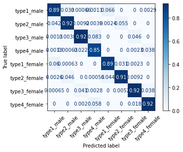
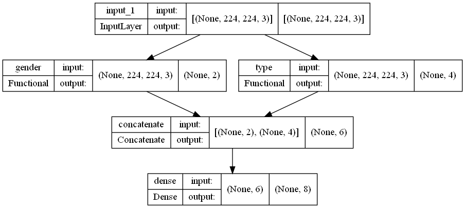
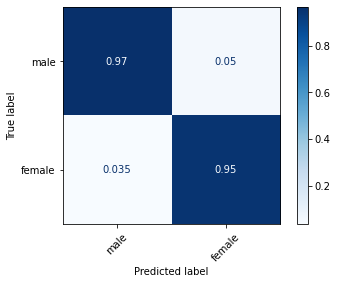
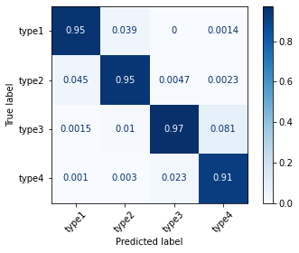
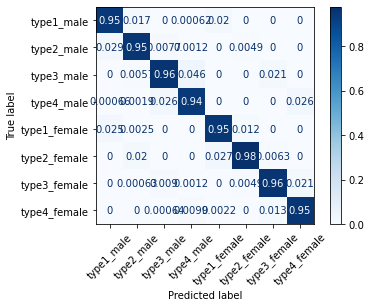

# Face-Mask-Detection

This project is developed to study popular deep learning networks in image classification and to use transfer learning in a practical application.  

## Objectives

1. Develop a neural network classifier to identify the eight classes defined by gender and different face mask worn type combinations.  
2. Tune the Keras/Tensorflow based model to obtain 90 % test accuracy with a balanced dataset.

## License

The source code hosted in this repository is shared under [MIT license](LICENSE).

## Sponsor

DataDisca Pty Ltd, Melbourne, Australia

[https://www.datadisca.com](https://www.datadisca.com)

## Dataset

Publicly available below Kaggle datasets were used for training, testing and validation. Please check the respective licenses of the datasets mentioned here before using them.

Note: The "Type ID" descriptions mentioned in the datasets should be corrected as in [this](https://www.kaggle.com/tapakah68/medical-masks-part1/discussion/254996) discussion post.

```Type 1 - Mask is worn correctly, covers the nose and mouth
Type 2 - Mask covers the mouth, but does not cover the nose
Type 3 - Mask is on, but does not cover the nose or mouth
Type 4 - No mask on the face```

1. [500 GB of images with people wearing masks. Part 1](https://www.kaggle.com/tapakah68/medical-masks-part1/) - Dataset 1 for training and testing
2. [500 GB of images with people wearing masks. Part 7](https://www.kaggle.com/tapakah68/medical-masks-part7) - Dataset 2 for validation

## Prerequisites

Latest tested versions are mentioned inside the brackets along with the library names for reference.

1. Python (3.9.7)
2. Jupyter Notebook (6.4.6) with IPython (7.29.0)
3. Pillow (8.4.0)
4. Numba (0.54.0rc1)
5. Numpy (1.22.0)
6. Pandas (1.3.4)
7. OpenCV (4.5.1)
8. Matplotlib  (3.5.0)
9. Tensorflow (2.9.0.dev20220102) including Keras (2.9.0.dev2022010308) and Tensorboard (2.8.0a20220102)
10. Scikit-learn (1.0.1)
11. Plotly (5.4.0)
12. Pydot (1.4.2) - Dependency for [tf.keras.utils.plot_model](https://www.tensorflow.org/api_docs/python/tf/keras/utils/plot_model)
13. Pydotplus (2.0.2) - Dependency for [tf.keras.utils.plot_model](https://www.tensorflow.org/api_docs/python/tf/keras/utils/plot_model) 
14. [GraphViz](https://graphviz.org/download/) (2.50.0) - Dependency for [tf.keras.utils.plot_model](https://www.tensorflow.org/api_docs/python/tf/keras/utils/plot_model)

## Preprocessing

The raw dataset is preprocessed with [preprocess.ipynb](Preprocess/preprocess.ipynb) in order to remove non-image files/incorrectly labelled files and to categorize into eight classes defined by gender and different face mask worn type combinations by checking the filenames.     

Before running the preprocessing script, the raw dataset should be extracted to "original_images".    
After runnning this script, there will be subfolders with classes mentioned in "classify_names" inside the "temp_base" preprocessed dataset output directory.

## Method 1

In the method, the model is trained to classify the all 8 classes in a single stage based on a pretrained [ResNet-50 model](https://www.tensorflow.org/api_docs/python/tf/keras/applications/resnet50/ResNet50). Most layers of the pretrained model are freezed and only a set of layers are trained along with new set of layers to suit the dataset. The full model and related details are included in the training script, [classify_once.ipynb](Method_1/classify_once.ipynb) which to be used with the dataset 1.

The output model is also verified  with the dataset 2 with verification script, [verification_once.ipynb](Method_1/verification_once.ipynb).

Confusion Matrix :



## Method 2

In the method, two models are trained to classify the gender (2 classes) with [classify_gender.ipynb](Method_2/classify_gender.ipynb) and face mask worn type (4 classes) with [classify_type.ipynb](Method_2/classify_type.ipynb) based on a pretrained [ResNet-50 model](https://www.tensorflow.org/api_docs/python/tf/keras/applications/resnet50/ResNet50). Most layers of the pretrained model are freezed and only a set of layers are trained along with new set of layers to suit the dataset. 

After that, the two trained models are concatenated to make a parallel network along with new layers, and trained with the full dataset similar to in method 1 with [train_combined.ipynb](Method_2/train_combined.ipynb).
The full models and related details are included in the training scripts, which to be used with the dataset 1.

The output model is also verified with the dataset 2 with verification script, [verification.ipynb](Method_2/verification.ipynb).

Final model:



Confusion Matrix for gender:



Confusion Matrix for type:



Confusion Matrix for final model:




## Detection Testing

A sample script, [check_image.ipynb](Test/check_image.ipynb) is provided to test a single image from a local file or an URL with the trained model.  
The output would be a classification from "classify_names" and a general description from "classify_desc" along with the image display.

## Summary

| Method              | Source Code         | Description | Confusion Matrix |  Test Accuracy (dataset 1) | Verification Accuracy (dataset 2) |
|-------------------------|-----------------|-------------------|-------------------|-------------------|-------------------|
| All | [preprocess.ipynb](Preprocess/preprocess.ipynb)  |Raw dataset preprocessing script before training models  | -   | -   | -   |
| 1  | [classify_once.ipynb](Method_1/classify_once.ipynb) |  Training script  | [CNF](Method_1/method1_cnf.png)   | 89.73 %   | -   |
| 1  | [verification_once.ipynb](Method_1/verification_once.ipynb) |  Verification script | -   | -  | 78.21 %  |
| 2  | [classify_gender.ipynb](Method_2/classify_gender.ipynb) |  Training script for gender model | [CNF](Method_2/cnf_gender.png)   | 96.22 %   | -   |
| 2  | [classify_type.ipynb](Method_2/classify_type.ipynb) |  Training script for type model | [CNF](Method_2/cnf_type.png)  | 94.60 %   | -   |
| 2  | [train_combined.ipynb](Method_2/train_combined.ipynb) |  Training script for final model | [CNF](Method_2/cnf_combined.png)   | 95.13 %   | -   |
| 2  | [verification.ipynb](Method_2/verification.ipynb) |  Verification script | -   | -  | 79.44 %  |
| All  | [check_image.ipynb](Test/check_image.ipynb) |  Script to test a single image from a local file or an URL with the trained model  | -   | -   | -   |


